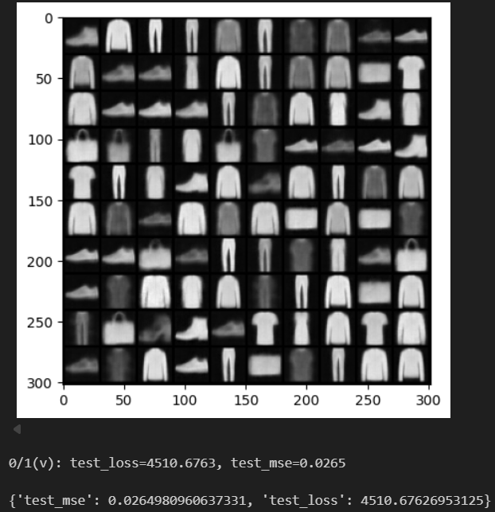
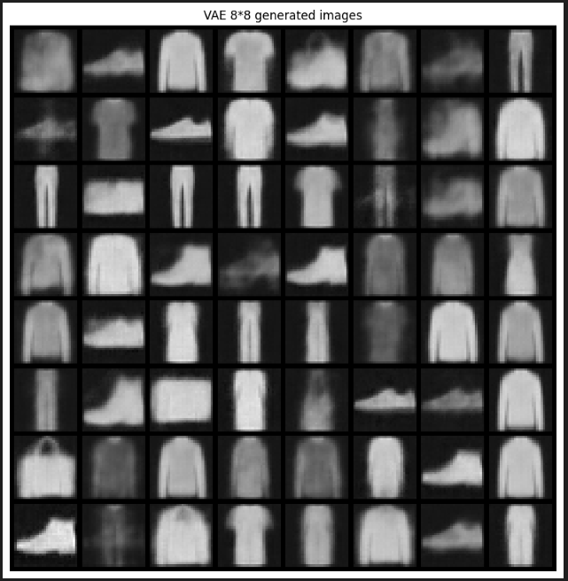
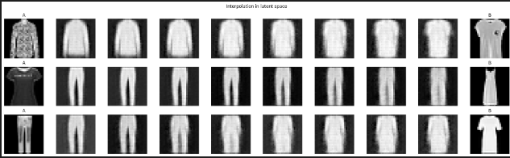

# Первая работа с генеративной моделью (VAE)

Полный pipeline представлен в разделе `Первая работа с генеративной моделью (VAE)` в ноутбуке `generative_modeling.ipynb`

За основу возьмем [Beta-VAE](https://openreview.net/pdf?id=Sy2fzU9gl) модель. Текущая модель представляет из себя трехслойную CNN, похожую на Beta-VAE. Свертки 4*4 с небольшим заполнением помогают легко определять размеры выходных данных для каждого слоя.

## Общая архитектура forward
```
1. Кодируем изображение:
    - Сначала фильтры ищут простые вещи: края, пятна
    - Потом следующие — более сложные: формы, куски цифр
    - По пути картинка становится всё меньше по размеру с более сжатой информацией
    - Преобразуем полученное в один единый список чисел
2. Вычисляем среднее - основной типичный вариант кода для этой картинки.
3. Вычисляем разброс - насколько сильно этот код может колебаться.
4. Учимся описывать облако похожих картинок - извлекаем латентный код
5. Восстанавливаем изображение по латентному коду и декодируем его, увеличивая размер и дорисовывая детали. Постепенно сеть размазывает и уточняет признаки, чтобы получилась цельная картинк
6. Сохраняем состояние на каждом шаге для функции потерь при обучении
```

Так, модель будет кодировать входное изображение в латентное пространство, выберет значения из этого пространства и декодирует их для полуения выходных данных.

В качестве loss функции будем использовать KL-дивергенцию.

## KL-дивергенция
Это мера того, насколько два распределения вероятностей отличаются друг от друга

```
Total Loss = Reconstruction Loss + β × KL Divergence

Reconstruction Loss (BCE/MSE): насколько восстановленная картинка похожа на оригинал

KL Divergence: насколько распределение кодов q(z|x) (от энкодера) похоже на стандартное N(0,1)
```

Логика KL:
> Пусть есть два мешка с шариками:
**Истинный мешок P** (реальность): 90% красных, 10% синих
**Предсказанный мешок Q** (модель): 70% красных, 30% синих
KL-дивергенция отвечает на вопрос:
Если я буду вытаскивать шарики из мешка Q, но думать, что вероятности как в P — сколько я потеряю информации?


Будем использовать именно ее потому, что:
```
P(z) = N(0, 1)  ← стандартное нормальное
Q(z|x) = N(μ, σ) ← то, что выучил энкодер для картинки x
```
Q(z|x) должен быть похож на N(0,1) для каждой картинки x. Если все коды z лежат около (0,0) в нормальном облаке — можно генерировать новые картинки, просто семплируя из N(0,1). Латентное пространство становится гладким и непрерывным:

```
KL(N(μ,σ) || N(0,1)) = ½ × Σ [μ² + σ² - 1 - log(σ²)]

KLD = -0.5 * torch.sum(1 + logvar - mu.pow(2) - logvar.exp()) * beta

logvar = log(σ²) — логарифм дисперсии
mu.pow(2) — насколько далеко центр от нуля
logvar.exp() — насколько большая дисперсия (σ²)
1 + logvar — нормализация для стандартного нормального
beta — умножаем на вес β (по умолчанию 5 для β-VAE)
```

Лосс реализуем через декоратор для torchbearer.

## Результаты

Результаты обучения:



Сгенерированные изображения:



Интерполяция:



**Выводы**
1. Насколько осмысленными выглядят сгенерированные изображения:
    - Изображения осмысленные и узнаваемые по метрике (MSE=0.0265) и визуально
    - Присутствует типичное размытие, но семантика одежды сохраняется

2. Оценка интерполяции:
    - Переходы плавные и предсказуемые в большинстве случаев
    - Резких скачков и шума не наблюдается

3. Общие выводы:
    - Латентное пространство организовано семантически: единый класс кластеризуется близко
    - Выбранных 10 измерений достаточно для захвате ключевых признаков одежды
    - Результат при базовой VAE на 20 эпохах очень хороший
    - Интерполяция дает постепенную эволюцию формы
    - Интерполяция эффективна, а пути выглядят реалистично