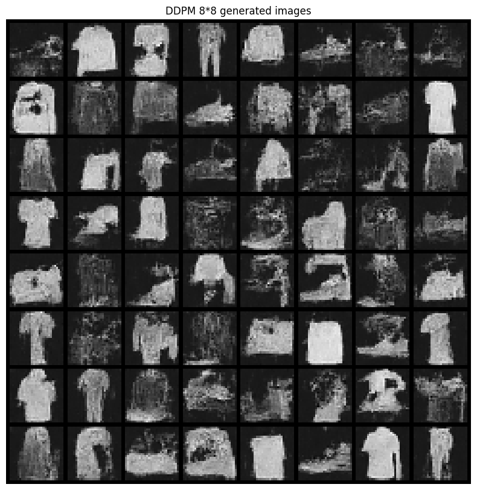
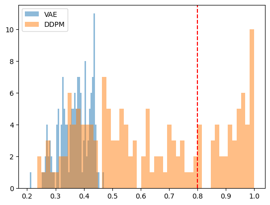

Работа нацелена на построение, обучение и сравнени генеративных моделей. В качестве датасета был выбран Fasion-MNIST:
- 70 000 черно-белых изображений (train: 60 000, test: 10 000)
- 28х28 пикселей
- 10 классов одежды

# Первая работа с генеративной моделью (VAE)

> Полный pipeline представлен в разделе Первая работа с генеративной моделью (VAE) в ноутбуке generative_modeling.ipynb

VAE (Variational Autoencoder) — это генеративная модель, которая расширяет классический автоэнкодер вероятностным подходом к латентному пространству.

**Кодировщик (Encoder):** x → (μ, σ)

Преобразует изображение x (784 пикселя) в распределение в латентном пространстве размерности 10:
μ — среднее значение
σ — стандартное отклонение

**Репараметризация:** z = μ + σ * ε, где ε∼N(0,1)

Позволяет дифференцировать шум через параметры распределения.

**Декодировщик (Decoder):** z→ ~x
 
Восстанавливает изображение из случайной точки латентного пространства.

За основу возьмем [Beta-VAE](https://openreview.net/pdf?id=Sy2fzU9gl) модель. Текущая модель представляет из себя трехслойную CNN, похожую на Beta-VAE. Свертки 4*4 с небольшим заполнением помогают легко определять размеры выходных данных для каждого слоя.

## Общая архитектура forward
```
1. Кодируем изображение:
    - Сначала фильтры ищут простые вещи: края, пятна
    - Потом следующие — более сложные: формы, куски цифр
    - По пути картинка становится всё меньше по размеру с более сжатой информацией
    - Преобразуем полученное в один единый список чисел
2. Вычисляем среднее - основной типичный вариант кода для этой картинки.
3. Вычисляем разброс - насколько сильно этот код может колебаться.
4. Учимся описывать облако похожих картинок - извлекаем латентный код
5. Восстанавливаем изображение по латентному коду и декодируем его, увеличивая размер и дорисовывая детали. Постепенно сеть размазывает и уточняет признаки, чтобы получилась цельная картинк
6. Сохраняем состояние на каждом шаге для функции потерь при обучении
```

Так, модель будет кодировать входное изображение в латентное пространство, выберет значения из этого пространства и декодирует их для полуения выходных данных.

В качестве loss функции будем использовать KL-дивергенцию.

## KL-дивергенция
Это мера того, насколько два распределения вероятностей отличаются друг от друга

```
Total Loss = Reconstruction Loss + β × KL Divergence

Reconstruction Loss (BCE/MSE): насколько восстановленная картинка похожа на оригинал

KL Divergence: насколько распределение кодов q(z|x) (от энкодера) похоже на стандартное N(0,1)
```

Логика KL:
> Пусть есть два мешка с шариками:
**Истинный мешок P** (реальность): 90% красных, 10% синих
**Предсказанный мешок Q** (модель): 70% красных, 30% синих
KL-дивергенция отвечает на вопрос:
Если я буду вытаскивать шарики из мешка Q, но думать, что вероятности как в P — сколько я потеряю информации?


Будем использовать именно ее потому, что:
```
P(z) = N(0, 1)  ← стандартное нормальное
Q(z|x) = N(μ, σ) ← то, что выучил энкодер для картинки x
```
Q(z|x) должен быть похож на N(0,1) для каждой картинки x. Если все коды z лежат около (0,0) в нормальном облаке — можно генерировать новые картинки, просто семплируя из N(0,1). Латентное пространство становится гладким и непрерывным:

```
KL(N(μ,σ) || N(0,1)) = ½ × Σ [μ² + σ² - 1 - log(σ²)]

KLD = -0.5 * torch.sum(1 + logvar - mu.pow(2) - logvar.exp()) * beta

logvar = log(σ²) — логарифм дисперсии
mu.pow(2) — насколько далеко центр от нуля
logvar.exp() — насколько большая дисперсия (σ²)
1 + logvar — нормализация для стандартного нормального
beta — умножаем на вес β (по умолчанию 5 для β-VAE)
```

Лосс реализуем через декоратор для torchbearer.

## Результаты

Результаты обучения:


Сгенерированные изображения:


Интерполяция:


**Выводы**
1. Насколько осмысленными выглядят сгенерированные изображения:
    - Изображения осмысленные и узнаваемые по метрике (MSE=0.0265) и визуально
    - Присутствует типичное размытие, но семантика одежды сохраняется

2. Оценка интерполяции:
    - Переходы плавные и предсказуемые в большинстве случаев
    - Резких скачков и шума не наблюдается

3. Общие выводы:
    - Латентное пространство организовано семантически: единый класс кластеризуется близко
    - Выбранных 10 измерений достаточно для захвате ключевых признаков одежды
    - Результат при базовой VAE на 20 эпохах очень хороший
    - Интерполяция дает постепенную эволюцию формы
    - Интерполяция эффективна, а пути выглядят реалистично


# Диффузионная модель (DDPM)

> Полный pipeline представлен в разделе Диффузионная модель (DDPM) в ноутбуке generative_modeling.ipynb


**DDPM** — это генеративная модель, которая создаёт изображения, постепенно убирая шум из случайного шума. В отличие от VAE, DDPM работает через 1000 мелких шагов, превращая шус в изображение.

**Core conv UNet**

Роль симметричного сверточного UNet-а заключается в определении шума или сигнала для каждого пикселя и предсказании шума в той же размерности


Ранее на курсе Нейронные сети я реализовывала [UNet архитектуру](https://github.com/0LinaSt0/pass_hometasks/blob/main/cv_nn/lab5_unet_segmentation.ipynb). Она была взята в качестве conv базы, но с апгрейдами: добавлена поддержка time conditionin, поменян выход финального слоя на выход шума, увеличино количество каналов и пр.


**При Forward Duffusion:**
```
x_t = √(1-β_t) × x_{t-1} + √β_t × ε, где ε ~ N(0,1)

β_t — маленькая доля шума на шаге t (0.0001 → 0.02)
```
К изображению добавляется шум 0.1% итеративно 1000 раз -> x₁₀₀₀ ~ N(0,1). За 1000 шагов картинка полностью разрушается до гауссова шума

**При Reverse Duffusion:**

Происходит обучение модели: на шаге `t` из `x_t` модель предсказывает шум `ε`, который был добавлен, и убират его. Это происходит итеративно 1000 раз. На финальном шаге получаем предсказанныйы конечный шум.

`MSE(ε_real, ε_predicted)`

Результат генерации:



# Сравнение архитектур

> Полный pipeline представлен в разделе Сравнение архитектур в ноутбуке generative_modeling.ipynb

Проведем сравнительный анализ двух подходов

Первым шагом обучим простой классификатор на Fasion MNIST для оценки генераторов. Далее сгенерируем 150 примеров каждым из генераторов и оценим метрики на этих сэмплах. Результаты:

```
VAE generation for 150 completed in 0.004 seconds
DDPM generation for 150 completed in 18.118 seconds
(torch.Size([150, 1, 28, 28]), torch.Size([150, 1, 28, 28]))
```


Оценим качество сгенерированных изображений через уверенность предобученного классификатора:
1. Предскажем класс для каждого изображения (максимальная вероятность)
2. Оценим долю изображений с уверенностью по трэшхолду в 80%
3. Определим среднюю уверенность по всем изображениям

Оценим уверенности по бинам визуально




Представим сравнительную таблицу 

| Характеристика     | VAE                | DDPM                |
| ------------------ | ------------------ | ------------------- |
| Latent space       | Фиксирован (10D)   | Каждый шаг меняется |
| Шаги генерации     | 1 forward          | 1000 forward        |
| Визуальное качество           | Визуально лучше, но объективно проигрывает из-за отсутствия четкости краев | Визуально присутствую артефакты, но объективно лучше с четкими контурами   |
| Метрика(avg_prob) | 0.37 | 0.64 |
| Скорость train     | Быстро             | Медленно            |
| Скорость генерации | 0.041/150 (sec/count)          | 18.126/150 (sec/count)           |


Таким образом, оценка сгенерированных двумя моделями 150 изображений показала, что несмотря на кажущуюся визуальную выгодность VAE модели, DDPM значительно превосходит VAE по метрикам:
- DDPM генерирует изображения с чёткими контурами, что более важно для CNN. Артефакты мешают визуальному восприятию
- VAE даёт размытые образцы из-за потерь при реконструкции — классификатор колебается между классами

Однако DDPM архитектура обучается значительно медленнее и, что более критично, по скорости генерации уступает VAE в ~400 раз.

Также стоит отметить, что обе модели обучались на 20 эпохах. Качество можно заметно улучшить, увеличив итерации.

Заключим, что метод генерации необходимо подбирать исходя из поставленной задачи.